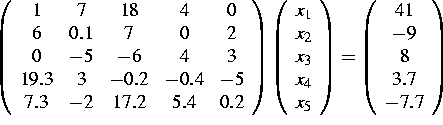

# Project 3: LU decomposition

A program was made in c++ in order to take a matrix and solve for a vector ‘x’ that satisfies the given equation. Concepts including LU decomposition were used which produced lower and upper triangular matrices. This process led to finding the inverse of the original matrix, and ultimately the determinant. 

## Description

<p align="center">
    Solve for the vector x that satisfies <br><br>
     <br><br>
    Calculate the inverse of the matrix above and test the accuracy of your solution. <br><br>
    Calculate the deterninant of the matrix above.
</p>

## Getting Started
### Dependencies
Run these commands in terminal to check if you have the dependencies 
```sh
/usr/bin/xcodebuild -version 
which brew
g++ --version
which gnuplot
```
If not, install them
* [XCode Command Line Tools](https://apps.apple.com/us/app/xcode/id497799835?mt=12)
* [Homebrew](https://brew.sh/index.html)
* GNU ```brew install gcc```
* GNUplot ```brew install gnuplot```

### Executing program
Switch to /PHYS4300-Numerical-Methods-and-Scientific-Computation/Project 1

* To compile a C++ code, use:
```sh
g++ <filename.C>
```
* To run the C++ code:
```sh
./a.out
```
* To run .gnu files
```sh
gnuplot
load "<filename.gnu>"
```

## Results

```sh
Original Matrix
         1         7        18         4         0
         6       0.1         7         0         2
         0        -5        -6         4         3
      19.3         3      -0.2      -0.4        -5
       7.3        -2      17.2       5.4       0.2
Original Vetor
        41
        -9
         8
       3.7
      -7.7
Original System in Whole
         1         7        18         4         0               41
         6       0.1         7         0         2               -9
         0        -5        -6         4         3                8
      19.3         3      -0.2      -0.4        -5              3.7
       7.3        -2      17.2       5.4       0.2             -7.7
Matrix after LU Decomposition
         1         7        18         4         0
         6     -41.9      -101       -24         2
         0  0.119332   6.05251   6.86396   2.76134
      19.3   3.15274  -4.81995   31.1498   2.00402
       7.3    1.2673   2.27965 -0.289959  -8.04841
L - Lower Trianguler Matrix
         1         0         0         0         0               41
         6         1         0         0         0             -255
         0  0.119332         1         0         0          38.4296
      19.3   3.15274  -4.81995         1         0          201.579
       7.3    1.2673   2.27965 -0.289959         1         -12.9943
U - Upper Triangular Matrix
         1         7        18         4         0        -0.268384
         0     -41.9      -101       -24         2          6.39256
         0         0   6.05251   6.86396   2.76134         -1.60828
         0         0         0   31.1498   2.00402          6.36739
         0         0         0         0  -8.04841          1.61452
L multiplied by U
         1         7        18         45.47077e-315
         6       0.1         7         0         2
2.14771e-314        -5        -6         4-4.37042e+184
      19.3         3      -0.2      -0.4        -5
       7.3        -2      17.2       5.4       0.2
Inverse Calculation
      V =          1         0         0         0         0
-0.00361118         0         0         0         0
  0.125838         0         0         0         0
-0.0142845         0         0         0         0
 0.0949672         0         0         0         0
 0.0545374         0         0         0         0

      V =          0         1         0         0         0
-0.00361118 0.0602669         0         0         0
  0.125838 0.0251982         0         0         0
-0.0142845 0.0171355         0         0         0
 0.0949672 -0.136273         0         0         0
 0.0545374  0.257965         0         0         0

      V =          0         0         1         0         0
-0.00361118 0.0602669 0.0236651         0         0
  0.125838 0.0251982 0.0466196         0         0
-0.0142845 0.0171355-0.0522632         0         0
 0.0949672 -0.136273  0.147684         0         0
 0.0545374  0.257965  0.109595         0         0

      V =          0         0         0         1         0
-0.00361118 0.0602669 0.0236651 0.0378237         0
  0.125838 0.0251982 0.0466196 0.0330391         0
-0.0142845 0.0171355-0.0522632-0.0225989         0
 0.0949672 -0.136273  0.147684 0.0344207         0
 0.0545374  0.257965  0.109595-0.0360269         0

      V =          0         0         0         0         1
-0.00361118 0.0602669 0.0236651 0.0378237 -0.012053
  0.125838 0.0251982 0.0466196 0.0330391 -0.125299
-0.0142845 0.0171355-0.0522632-0.0225989 0.0476206
 0.0949672 -0.136273  0.147684 0.03442070.00799349
 0.0545374  0.257965  0.109595-0.0360269 -0.124248

As you can see, A * A^-1 = 1
         1         0         0         0         0
         0         1         0         0         0
         0         0         1         0         0
         0         0         0         1         0
         0         0         0         0         1

The determinant of A is
63579.2
```
